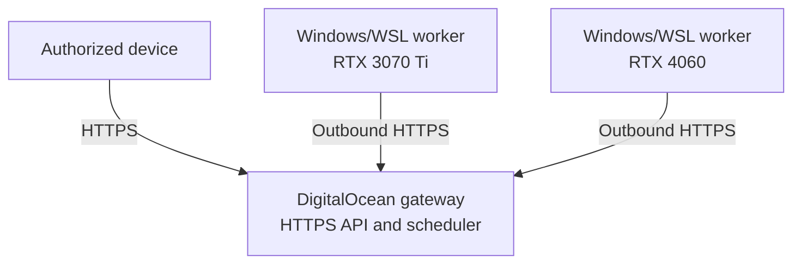

# GPUlink

GPUlink is an open-source platform for securely scheduling and serving GPU
workloads across personal computers.

Applications use one public API. GPU workers remain behind their normal home
network boundaries and connect outward to the control plane. GPUlink schedules
work by capability, available VRAM, model locality, priority, health, and worker
availability.

## Current milestone

The first operational target supports:

- a DigitalOcean-hosted HTTPS gateway and control plane;
- outbound-only Windows/WSL GPU workers;
- NVIDIA discovery and telemetry through `nvidia-smi`;
- separate client, worker, and administrator credentials;
- durable SQLite worker, job, lease, and event state;
- exclusive one-job-per-GPU scheduling;
- minimum-VRAM and capability constraints;
- worker heartbeats, drain mode, lease expiry, and bounded retries;
- idempotent job submission;
- replayable server-sent operational events;
- Prometheus-format platform metrics;
- an allowlisted GPU status diagnostic;
- systemd services for the droplet and WSL;
- a Windows sign-in task that starts the WSL worker.

GPUlink does not accept arbitrary commands, Python, or containers. Model
adapters such as Parakeet and local LLM serving come after this diagnostic
milestone is accepted on physical hardware.

## Architecture



The control plane binds to `127.0.0.1` on the droplet. Caddy terminates public
HTTPS and proxies to that private listener. Workers poll outward for leases, so
no inbound port is opened on a desktop or laptop.

## Requirements

- Node.js 24 or newer
- Ubuntu systemd host for the control plane
- Windows 11 with WSL2 and systemd for GPU workers
- NVIDIA drivers with a working `nvidia-smi` inside WSL
- A domain or subdomain pointed at the DigitalOcean droplet

GPUlink has no npm runtime dependencies.

## Local verification

```bash
node --check src/control-plane/main.mjs
node --check src/worker/main.mjs
node --check src/cli/main.mjs
node --test
```

## Deployment

Follow [First Operational Target](docs/FIRST_OPERATIONAL_TARGET.md). It covers:

1. DigitalOcean control-plane installation
2. Caddy HTTPS configuration
3. Desktop and laptop WSL enrollment
4. External diagnostic submission
5. Drain, restart, persistence, and reconnection acceptance checks

Do not expose port `8088` publicly. Do not reuse a client, worker, or admin
token for another scope.

## Command-line operations

Configure the public URL and appropriate credential:

```bash
export GPULINK_URL=https://gpu.example.com
export GPULINK_CLIENT_TOKEN=replace-me
export GPULINK_ADMIN_TOKEN=replace-me
```

Then:

```bash
npm run cli -- workers
npm run cli -- submit-diagnostic 256
npm run cli -- wait <job-id>
npm run cli -- drain <worker-id>
npm run cli -- resume <worker-id>
```

## Documentation

- [Architecture](docs/ARCHITECTURE.md)
- [API](docs/API.md)
- [Roadmap](docs/ROADMAP.md)
- [First Operational Target](docs/FIRST_OPERATIONAL_TARGET.md)
- [Security Policy](SECURITY.md)
- [Contributing](CONTRIBUTING.md)

## License

GPUlink is licensed under Apache-2.0. GPUlink does not bundle model weights;
operators are responsible for complying with the license of every model they
install.
