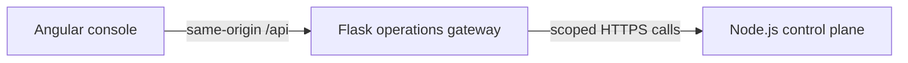

# Architecture

## Product boundary

The platform is a resource control system. It does not know how Parakeet,
vLLM, llama.cpp, or an image model performs inference.

The control plane owns:

- identity and admission;
- worker and GPU inventory;
- scheduling constraints and priorities;
- exclusive GPU leases;
- worker liveness and drain state;
- retry and terminal failure decisions;
- durable job state;
- operational events and metrics.

The worker owns:

- local GPU discovery and telemetry;
- model and adapter availability reporting;
- acceptance of a valid lease;
- launching an allowlisted workload adapter;
- reporting start, completion, failure, and cancellation;
- local cleanup after a lease ends.

A workload adapter owns:

- model loading and unloading;
- model-specific request validation;
- inference protocol translation;
- model-level health and metrics;
- graceful cancellation and cleanup.

## Adapter manifests

Each installed worker adapter has a repository-owned manifest with schema
version, workload type, semantic adapter version, and one allowlisted execution
mode. The current execution modes are `in-process`, `bounded-process`, and
`streaming-gateway`. A manifest is metadata, not executable configuration: it
cannot contain commands, arguments, environment variables, container images,
or paths.

Workers advertise manifests only for configured adapters whose readiness checks
pass. The control plane validates that every manifest matches an advertised
capability, then persists the manifest list with the worker heartbeat. Existing
databases gain the new manifest column through an additive migration, and older
workers remain compatible by reporting an empty list.

The same probe produces a bounded health report for every configured adapter:
`ready`, `unavailable`, or `not-installed`. Each state has one fixed code and a
worker-owned check timestamp. Probe exceptions are deliberately collapsed into
`readiness_probe_failed`; raw messages, paths, environment values, and stack
traces never cross the worker boundary. When a new worker supplies health, the
control plane requires the ready health set, manifest set, and advertised
capability set to match exactly. Older workers may omit the report.

The built-in diagnostic adapters are versioned in-process adapters. The GPU
benchmark is a versioned bounded-process adapter. `speech.streaming` has a
shared session contract but deliberately has no manifest until a real Parakeet
adapter and readiness check are installed.

## Bounded process launcher

Process-backed adapters share one worker-owned launcher. It requires an
absolute executable path and a bounded string-only argument list, never invokes
a shell, ignores stdin, captures stdout and stderr under one combined byte
limit, and enforces a finite timeout. Cancellation or timeout terminates the
child process group, followed by a bounded forced-kill grace period.

The launcher is an internal primitive rather than a client-facing workload.
Only repository-owned adapter code can choose its executable and arguments.
Adapters retain responsibility for validating remote payloads and constructing
their fixed invocation. The benchmark maps generic process failures back to its
existing public error contract.

## Bounded GPU benchmark adapter

`benchmark.gpu` is the first real CUDA execution path. It is not a generic
Python or process adapter. The client supplies only a schema version, one of
four allowlisted matrix sizes, and bounded warmup/measured iteration counts.
The control plane validates and normalizes that contract before persistence;
the worker validates it again before execution.

The worker launches one repository-owned Python script through one configured,
absolute interpreter path without a shell. It supplies a minimal environment,
sets `CUDA_VISIBLE_DEVICES` to the leased GPU UUID, caps stdout and stderr,
enforces a fixed timeout, and terminates the child process group on timeout or
lease cancellation. The worker—not the Python process—attaches authoritative
GPU identity and timing boundaries to the result.

Workers advertise `benchmark.gpu` only when the capability is configured and a
bounded health probe confirms the isolated PyTorch CUDA runtime can see exactly
one selected GPU. The probe is refreshed periodically rather than on every
heartbeat. CI injects a fake process runner and does not require NVIDIA hardware.

## Transcription session contract

The first Parakeet foundation slice defines a versioned `speech.streaming`
session request without pretending the streaming data plane is a normal durable
job payload. The persisted request contains only the `transgo-v1` protocol
version, the fixed 16 kHz mono signed-16-bit PCM/100 ms frame contract, and
whether interim results are requested. Unknown fields are rejected by the
control plane.

No audio bytes, audio URLs, client credentials, executable commands, or process
configuration enter the scheduler database. A worker does not advertise
`speech.streaming` merely because this shared contract exists. Advertisement
will begin only after the Parakeet adapter and its readiness probe are installed.

TransGo continues to own audio capture, the 16 kHz mono PCM contract,
interim/final caption rendering, and client reconnection behavior. Its existing
`/v1/transcription` WebSocket protocol will be preserved by a TransGo adapter.

## Model cache inventory

Each worker may maintain a root-local JSON manifest for models already present
on that host. Discovery accepts at most 64 entries, bounds the manifest to 64
KiB, requires every target to exist under the configured cache root, and checks
resolved paths so symlinks cannot escape that root. An invalid or unreadable
manifest fails closed to an empty report.

The control plane receives only the schema version, model ID, revision, and
adapter type. Absolute paths and manifest-relative paths remain private to the
worker. Cached inventory is intentionally separate from `warmModels`: cached
means the model can be loaded locally, while warm means it is already resident.

## Control and data planes

Scheduling and lifecycle operations go through the control plane. Large or
latency-sensitive workload data should not be placed into the durable scheduler
database.

For streaming transcription, the control plane will grant a lease and the
gateway will connect the client session to the leased Parakeet adapter. Audio
frames remain on the streaming data path. For LLM serving, GPUlink's native
platform API remains authoritative. An optional OpenAI-format compatibility
adapter may later let existing LLM tools call local models without redefining
GPUlink's scheduling or identity model.

## Deployment topology

The public DigitalOcean droplet runs the control plane in a resource-bounded,
read-only Docker container. Docker publishes it only on loopback, while the
droplet's existing Nginx service is the public listener and terminates HTTPS.
Each Windows GPU host runs the worker under WSL2 and initiates outbound HTTPS
requests to the droplet; no worker port is exposed to the internet. Workers can
be drained before gaming, maintenance, or desktop-heavy work and resumed
without changing their identity.

## Operations console

The first visual operations slice uses Angular for presentation and a small
Flask backend-for-frontend for read-only aggregation:



Flask holds the existing administrator and client bootstrap credentials in its
process environment. Angular never receives either credential. The gateway
returns bounded fleet and job projections, excludes job payloads and results,
and adds no cross-origin access. The development listener stays on loopback.

The control plane remains the only authority for scheduling and durable state.
The operations gateway does not write to the scheduler database, emulate job
state, or contact workers directly. Authenticated production exposure and safe
administrative controls are later dashboard slices.

## Durable state machine

Jobs use these states:

```text
queued -> leased -> running -> succeeded
   |         |         |
   |         |         +-------> failed
   |         +-----------------> queued (expired lease, retry allowed)
   +---------------------------> cancelled
```

The database is the authority. Events are an ordered operational projection,
not the source of truth. The control plane retains the most recent 10,000
events so high-frequency operation cannot grow the event table without bound.

## Reliability invariants

1. A GPU has at most one active `leased` or `running` job in Milestone 1.
2. A drained or stale worker receives no new leases.
3. A lease has an explicit expiry time and attempt number.
4. Start, renewal, and completion are rejected after the lease expiry time.
5. An expired lease is requeued only while attempts remain.
6. Terminal jobs are never rescheduled.
7. Scheduler decisions are made inside a database transaction.
8. Job completion is accepted only from the worker holding the active lease.
9. Idempotency keys prevent accidental duplicate job submission per project.
10. Worker telemetry is bounded and validated before persistence.
11. User payload content is never copied into metrics labels.

## Scheduling policy

Milestone 1 supports one GPU per job. A worker is eligible when it is online,
not draining, fresh enough, and advertises every required capability. A GPU is
eligible when it is not leased and its reported free VRAM, minus the configured
safety margin, satisfies `minVramMiB`.

Eligible placements are ordered by:

1. warm-model match;
2. cached-model match;
3. lowest current GPU utilization;
4. smallest sufficient VRAM headroom;
5. stable worker/GPU identity for deterministic ties.

The smallest-sufficient preference prevents small jobs from consuming the
largest GPU unnecessarily.

## Security boundary

The first operational target has separate client, worker, and administrator
bootstrap tokens. The administrator token is a deliberate super-scope for
single-owner recovery. The service refuses short or duplicated tokens. HTTPS is
mandatory for internet traffic, secrets live in root-readable environment
files, and workers make outbound-only connections. Later milestones replace
the bootstrap credentials with hashed, individually revocable project and
worker credentials.

Workers will execute only configured adapter manifests. Arbitrary command,
Python, shell, and container submission is intentionally excluded.

The llama.cpp RPC backend is not part of the trusted platform data plane.

## TransGo compatibility

The future TransGo adapter preserves:

- WebSocket path `/v1/transcription`;
- subprotocol `transgo-v1`;
- browser token subprotocol `transgo-token.<token>` during migration;
- start-session and `session_started` handshake;
- binary 100 ms PCM chunks at 16 kHz mono;
- sequence IDs and interim/final caption messages;
- health checks and decoder input guards;
- P50/P95/P99 capture, queue, inference, and render timing.

The adapter will translate those semantics into a scheduler lease without
requiring changes to the existing TransGo clients during the first migration.
